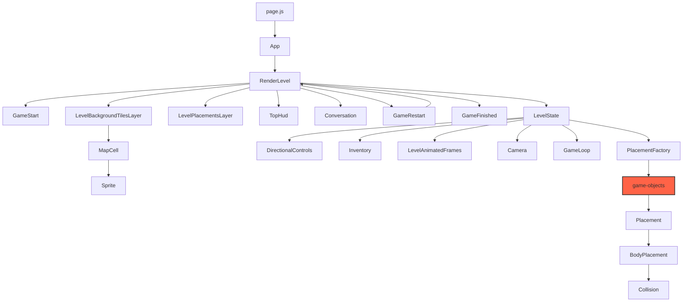

# Contact Information Madness

# Structure
This is the primary structure of the application. I have not included every class and utility file. Most of the classes have to do with different placement objects. 

# About
This is a simple game to create an interactive way to share contact details. This is really a joke about how complicated it is to find contact information on most corporate websites. 

If you would like to learn more about game development for the browser, I would suggest checking out [Drew Conley's Site](https://www.coopmode.dev/) This was incredibly helpful and much of the code in this project is based on his [Ciabatta's Revenge](https://www.coopmode.dev/series/ciabattas-revenge/) tutorial series.

# Adding New Game Objects
When adding new visual elements you must: 
1. Add the element to the sprite sheet.
2. Add the element to the `consts.js` file.
3. Add the coordinates of the element on the spritesheet in the `tiles.js` file.
4. Create a new class for the element in the `game-objects` folder.
5. Add the element to the `PlacementFactory.js` file.

*Note*

If the element is animated, you must add this logic in the `LevelAnimatedFrames.js` file.